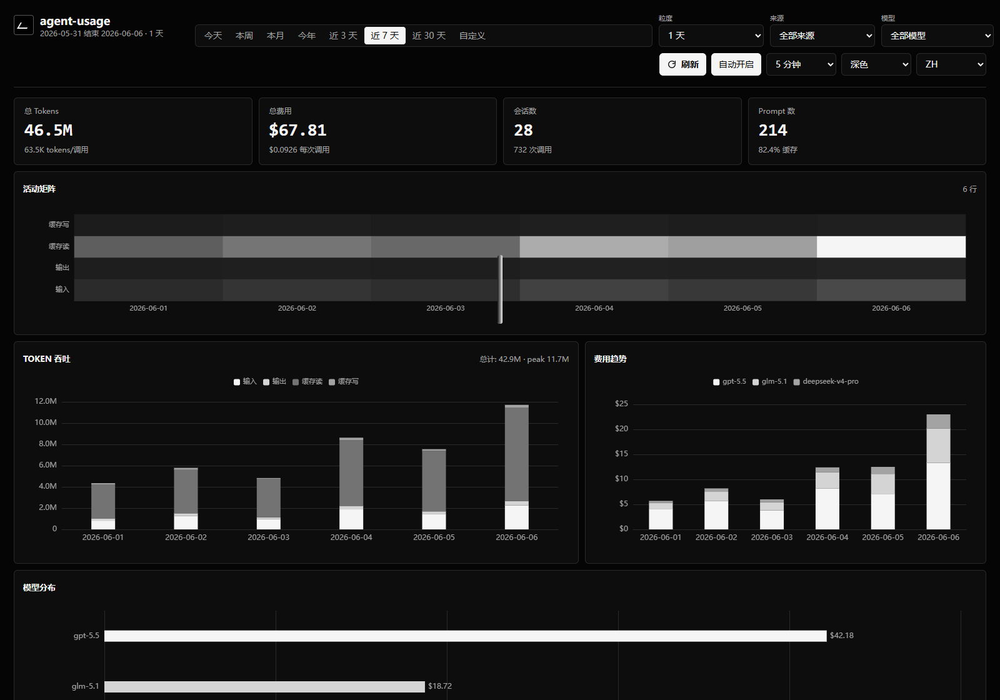

# Agent Ledger

Private local AI Agent FinOps, workload ledger, quota, pricing, audit, and productivity console for Claude Code, Codex, OpenCode, OpenClaw, kiro, Pi, and related local coding agents.

[中文文档](README_CN.md)



## Fork And Credits

Agent Ledger is an independent ZhenZhi second-development project based on [briqt/agent-usage](https://github.com/briqt/agent-usage). We keep the local-first collector foundation and thank the original author and contributors for the clean single-binary design.

The project has been renamed from `agent-usage` to `agent-ledger`. Old local databases and configs are not deleted automatically.

## What It Does

- Collects local usage records from Claude Code, Codex, OpenCode, OpenClaw, kiro, and Pi.
- Calculates token cost with local pricing governance: local overrides, official OpenAI/Anthropic seeds, and LiteLLM fallback.
- Explains expensive sessions without reading prompt content.
- Tracks budgets, burn rate, local quota estimates, cache health, model call counts, anomalies, and source health.
- Promotes raw sessions into a canonical Workload Ledger with goal, run, model-call, tool-call, artifact, evaluation, and policy-decision tables.
- Provides local audit logs, privacy presets, exports, reports, evidence bundles, and team showback data.
- Runs as one Go binary with embedded static UI and SQLite.

## Quick Start

```bash
git clone https://github.com/zhenzhis/agent-ledger.git
cd agent-ledger
go build -o agent-ledger .
./agent-ledger
```

Open [http://127.0.0.1:9800](http://127.0.0.1:9800).

Docker:

```bash
docker compose up -d --build
```

CLI:

```bash
./agent-ledger today
./agent-ledger top
./agent-ledger doctor
./agent-ledger battery
./agent-ledger workload list
./agent-ledger workload create --goal "review strategy engine" --source codex --project quant
./agent-ledger workload start-run --workload-id wl_... --source codex --agent-name codex
./agent-ledger workload heartbeat --run-id run_... --status working --phase testing --progress 0.5
./agent-ledger workload liveness --max-age 10m --stale-only
./agent-ledger workload state --workload-id wl_... --max-age 10m
./agent-ledger workload feed --severity warning --max-age 10m
./agent-ledger workload link --from wl_child --to wl_parent --relation depends_on
./agent-ledger workload evaluation --workload-id wl_... --run-id run_... --status pass --score 0.97 --signal unit-tests
./agent-ledger run --goal "debug ingestion" --agent codex -- codex
./agent-ledger event schema
./agent-ledger event examples --type model.call
./agent-ledger event validate --file event.json
./agent-ledger event ingest --file event.json
./agent-ledger adapter spec
./agent-ledger adapter conformance --kind provider --strict --file fixture.json
./agent-ledger discovery
./agent-ledger integrations
./agent-ledger runtime
./agent-ledger notify webhook --dry-run --severity warning
./agent-ledger otel convert --file spans.json
./agent-ledger otel ingest --file spans.json
./agent-ledger a2a convert --file task.json
./agent-ledger a2a ingest --file task.json
./agent-ledger provider convert --file response.json
./agent-ledger provider ingest --file response.json
./agent-ledger projection quality
./agent-ledger projection repair --source gateway --from 2026-06-07 --to 2026-06-07
./agent-ledger reconcile parse --file provider-bill.csv --format csv
./agent-ledger reconcile import --file provider-bill.csv --format csv --provider openai
./agent-ledger reconcile status
./agent-ledger router simulate --to-model gpt-5-mini --from-model gpt-5 --ratio 0.5
./agent-ledger replay --source codex --session-id <id>
./agent-ledger badge --project repo-name --metric cost --out agent-ledger.svg
./agent-ledger preflight --task refactor --project repo-name
./agent-ledger bundle export --privacy --signed --out usage-bundle.json
./agent-ledger bundle import --file usage-bundle.json --verify
./agent-ledger policy evaluate --model gpt-5.5 --action model.call
./agent-ledger policy approvals
./agent-ledger policy enforcement --privacy
./agent-ledger policy resolve --id apr_... --status approved
./agent-ledger audit --action pricing --role operator --format markdown --privacy
./agent-ledger pricing sync
./agent-ledger wrapped
./agent-ledger mcp
```

Strict adapter fixtures are available in `examples/adapter-fixtures/` for canonical events, provider usage envelopes, OpenTelemetry GenAI spans, and A2A task snapshots.

## Configuration

Config search order:

1. `--config path/to/config.yaml`
2. `/etc/agent-ledger/config.yaml`
3. `./config.yaml`

Minimal example:

```yaml
server:
  port: 9800
  bind_address: "127.0.0.1"

storage:
  path: "./agent-ledger.db"

pricing:
  sync_interval: 1h
  stale_after: 24h
  mode: official-plus-litellm
  overrides: []

privacy:
  default_preset: normal
  redact_paths: false
  hash_session_ids: false
  hide_project_names: false
  screenshot_mode: false

rbac:
  enabled: false
  read_only: false

webhooks:
  enabled: false
  url: ""
  timeout: 10s
  max_events: 20

integrations:
  otlp_receiver:
    enabled: false
    max_body_bytes: 4194304
    max_spans: 1000

gateway:
  enabled: false
  upstream_base_url: "https://api.openai.com"
  api_key_env: "OPENAI_API_KEY"
  include_stream_usage: true
  max_body_bytes: 4194304
  max_response_bytes: 33554432
  timeout: 120s
```

Use `pricing.overrides` for enterprise contracts, relay pricing, regional multipliers, or provider-specific discounts.

The optional gateway is a local OpenAI-compatible Chat Completions proxy. It is disabled by default, supports JSON responses and SSE streaming, reads the upstream API key from the configured environment variable, and records token usage plus audit metadata without storing request messages or response content. For streaming calls, `include_stream_usage: true` asks compatible upstreams for a final usage chunk when the client did not explicitly set `stream_options.include_usage`; set it to `false` for relays that reject that option.

Webhook notifications are disabled by default. When explicitly enabled, `POST /api/notifications/webhook` and `agent-ledger notify webhook` send only bounded workload-event and pending-approval summaries. Goals, projects, repos, branches, teams, approval targets, approval reasons, event ids, workload ids, run ids, and approval request ids are redacted or hashed. Use `--dry-run` or `dry_run=1` to inspect the outgoing payload without sending.

Gateway requests can attach ledger context through query parameters or request `metadata`: `agent_ledger.project`, `agent_ledger.goal`, `agent_ledger.workload_id`, `agent_ledger.agent_run_id`, `agent_ledger.session_id`, and `agent_ledger.git_branch`. This lets wrappers, MCP tools, and async agents bind live model calls to an existing workload/run without exposing prompt content.

## Pricing Model

Agent Ledger stores non-overlapping token components:

```text
total = input_tokens
      + cache_creation_input_tokens
      + cache_read_input_tokens
      + output_tokens
```

Cost formula:

```text
cost = input_tokens * input_price
     + cache_creation_input_tokens * cache_write_price
     + cache_read_input_tokens * cache_read_price
     + output_tokens * output_price
```

Pricing priority:

1. Local override.
2. Official OpenAI/Anthropic seed rows.
3. LiteLLM fallback from `model_prices_and_context_window.json`.
4. Source-reported cost, preserved for sources such as OpenCode when present.

Every priced record can expose pricing source, matched model, match type, and confidence. Unknown or stale prices are surfaced as data quality issues instead of being hidden.

References:

- [OpenAI API pricing](https://openai.com/api/pricing/)
- [Anthropic Claude pricing](https://platform.claude.com/docs/en/about-claude/pricing)
- [LiteLLM model price data](https://github.com/BerriAI/litellm/blob/main/model_prices_and_context_window.json)

## Architecture

```text
collectors / CLI wrapper / MCP tools -> canonical events -> workload ledger
                                     -> raw usage + pricing governance -> aggregates
                                     -> REST API -> embedded dashboard / CLI
```

Core tables:

- `canonical_events`: normalized event stream for future collectors, MCP, A2A, and gateways, including schema/source/parser provenance and privacy-safe native references.
- `workloads`, `agent_runs`, `agent_run_events`, `model_calls`, `tool_calls`: goal/run/heartbeat/call ledger.
- `workload_sessions`: compatibility link from old source-scoped sessions to workloads.
- `context_refs`, `artifacts`, `evaluations`, `policy_decisions`, `workload_links`: privacy-safe AgentOps context, artifact, outcome, governance, dependency, and lineage records.
- `usage_records`: raw API-call token and cost data.
- `sessions`: source-scoped session metadata.
- `prompt_events`: prompt timestamps for time-accurate prompt counts.
- `pricing`, `pricing_sources`, `pricing_snapshots`: effective price rules and source health.
- `hourly_usage_aggregate`, `daily_usage_aggregate`: dashboard rollups.
- `reconciliation_imports`: local provider bill comparisons with payload hash and statement window.
- `ingestion_health`, `insight_events`, `audit_log`: operations and quality evidence.

## API Surface

Common filters: `from`, `to`, `source`, `model`, `project`, `privacy`.

| Endpoint | Purpose |
|---|---|
| `GET /.well-known/agent-ledger.json` | Privacy-safe local discovery manifest for agents, wrappers, and routers |
| `GET /api/discovery` | Same discovery manifest under the API namespace |
| `GET /api/runtime/status` | Runtime mode, read-only state, background task, and write-operation status |
| `GET /api/dashboard` | Consistent KPI, token, cost, and model bundle for the web dashboard |
| `GET /api/stats` | Summary stats |
| `GET /api/workloads` | Server-side paginated workload ledger |
| `POST /api/workloads` | Create a local workload |
| `POST /api/workloads/close` | Close a workload with status/outcome |
| `POST /api/workloads/link` | Create a metadata-only dependency or lineage edge between workloads |
| `POST /api/agent-runs` | Start a run attached to an existing workload |
| `POST /api/agent-runs/heartbeat` | Append metadata-only async run liveness/progress |
| `GET /api/agent-runs/liveness` | List active runs and stale heartbeat state |
| `GET /api/workload-detail` | Workload runs, model calls, tools, sessions, policies |
| `GET /api/workload-graph` | Compact workload graph |
| `GET /api/workload-timeline` | Chronological workload audit timeline |
| `GET /api/workload-state` | Derived terminal-state snapshot for one async agent workload |
| `GET /api/workload-events` | Derived local workload state feed for monitors, routers, and notification adapters; returns `cursor`, `generated_at`, and `ETag` for incremental polling |
| `GET /api/workload-events/stream` | Local SSE workload state stream for polling monitors and router subscriptions; emits the feed cursor as the SSE `id` |
| `POST /api/notifications/webhook` | Explicitly send a redacted workload-event summary to the configured webhook |
| `GET /api/integrations` | Privacy-safe integration capability catalog |
| `GET /api/integrations/adapter-spec` | Machine-readable adapter contract for future agent CLIs, frameworks, gateways, OTel, A2A, and provider integrations |
| `POST /api/integrations/conformance` | Validate adapter fixtures for canonical, provider, OpenTelemetry GenAI, or A2A compatibility without writing SQLite; `strict=true` turns provenance warnings into failures |
| `GET /api/event-schema` | Canonical event schema and supported event types |
| `GET /api/event-examples` | Privacy-safe canonical event templates, filterable by `type` or `event_type` |
| `POST /api/events/validate` | Validate canonical metadata-only events without writing to SQLite |
| `POST /api/events` | Ingest metadata-only canonical events |
| `POST /api/otel/genai` | Convert OpenTelemetry GenAI JSON spans into canonical model-call events |
| `POST /v1/traces` | Optional local OTLP HTTP/JSON traces receiver when `integrations.otlp_receiver.enabled` is true |
| `POST /api/otlp/v1/traces` | Same receiver under the API namespace for local reverse proxies |
| `POST /api/a2a/tasks` | Convert A2A JSON task snapshots/events into workload/run/artifact/evaluation events |
| `POST /api/provider/calls` | Convert provider response usage envelopes into canonical model-call events |
| `POST /gateway/openai/v1/chat/completions` | Optional OpenAI-compatible gateway for JSON and SSE streaming when `gateway.enabled` is true |
| `GET /api/reconciliation/status` | Recent local/provider bill comparisons |
| `POST /api/reconciliation/import` | Import manual summary or provider CSV/JSON statement for local reconciliation |
| `GET /api/router/simulate?to_model=gpt-5-mini&ratio=0.5` | Simulate cost impact of model-routing changes without mutating the ledger |
| `GET /api/preflight/estimate?task=refactor&project=repo-name` | Estimate likely cost/tokens before starting an agent workload |
| `GET /api/chargeback` | Team/project/source/model showback using usage records joined with workload metadata |
| `GET /api/fleet-attribution` | Sub-agent, parent run, and parallel-run cost attribution |
| `GET /api/wrapped?period=monthly&format=markdown` | Monthly/weekly/yearly Agent Wrapped summary without prompt analysis |
| `POST /api/policy/evaluate` | Evaluate local advisory policy rules and optionally record decisions |
| `GET /api/policy/audit` | Audit historical usage, tool calls, and workloads against local policy rules |
| `GET /api/policy/enforcement` | Local policy enforcement evidence across decisions, approvals, and audit events |
| `GET /api/policy/approvals?status=pending` | List local pending, approved, rejected, or all policy approval requests |
| `POST /api/policy/approvals` | Approve or reject a local policy approval request |
| `GET /api/audit-log?action=pricing&role=operator` | Filter local operational audit events; supports `from`, `to`, `actor`, `role`, `action`, `target`, `limit`, and privacy mode |
| `GET /api/sessions` | Server-side paginated session ledger |
| `GET /api/session-replay?source=codex&session_id=...` | Chronological per-call token/cost replay for one session |
| `GET /api/badge/repo.svg?project=repo-name&metric=cost` | Local SVG repo cost/tokens/cache badge |
| `GET /api/model-registry` | Pricing and model governance registry |
| `GET /api/pricing/status` | Pricing freshness, source state, effective rule summary, unpriced models |
| `POST /api/pricing/sync` | Sync pricing |
| `POST /api/pricing/recalculate?mode=zero|all` | Recalculate costs |
| `POST /api/projections/repair` | Repair canonical `model_calls` to `usage_records` projection drift and rebuild aggregates |
| `GET /api/cost-intelligence` | Expensive session explanations |
| `GET /api/cache/doctor` | Cache hit/write/read diagnostics |
| `GET /api/doctor?format=markdown` | One-click local diagnostics for usage, ingestion, pricing, data quality, and workload state |
| `GET /api/data-quality` | Trust and completeness report |
| `GET /api/model-calls` | Calls by model/source/project |
| `GET /api/quota/status` | Local quota and burn-rate estimates |
| `GET /api/anomalies` | Robust-statistics anomaly events |
| `GET /api/watchdog/events` | Scoped runaway, call-density, cache-miss-risk, and non-working-hour watchdog events |
| `GET /api/evidence-bundle` | Redacted support/audit bundle with health, pricing, consistency, anomaly, and workload-state evidence |
| `GET /api/offline-bundle/export` | Export signed/hashed offline bundle |
| `POST /api/offline-bundle/import` | Import offline bundle canonical events |
| `GET /api/export?type=workloads&format=csv` | CSV/JSON exports |
| `GET /api/export?type=chargeback&format=csv` | Team showback CSV export |
| `GET /api/report?format=markdown` | Markdown report |

Manual scan, reset, pricing sync, imports, and recalculation require localhost access unless auth tokens are configured. Set `rbac.read_only: true` for observer deployments; Agent Ledger then rejects REST/CLI write operations, disables background scans, pricing sync, cost recalculation, and suppresses derived writebacks from GET endpoints.

When a policy returns `require_approval`, Agent Ledger records a local pending approval request and returns its id. Admins can approve or reject it through `POST /api/policy/approvals` or `agent-ledger policy resolve`; the original operation can then be retried with `approval_id=<id>` or `X-Agent-Ledger-Approval: <id>`.

## MCP Tool Surface

`agent-ledger mcp` starts a local stdio JSON-RPC tool server for agent frameworks and wrappers. The implementation is intentionally local and privacy-preserving: tools can create or close workloads, link workload dependencies, start runs on existing workloads, append run heartbeats, check run liveness and terminal-state snapshots, record tool-call metadata, context refs, hashed artifacts, and quality/evaluation signals, ask for advisory policy decisions, query local budget state, explain cost, and find similar workloads. Resources expose metadata-only schema, integration, budget, workload, terminal-state, and policy context; prompts provide reusable workload/cost-review/evidence templates. It does not read prompt content and does not send data to a remote MCP host by itself. MCP, REST, and CLI policy evaluation share the same local evaluator so advisory decisions are consistent across integrations.

`GET /api/integrations`, `GET /.well-known/agent-ledger.json`, `agent-ledger integrations`, and MCP `ledger.integrations` expose runtime capability fields: `writes_local_state`, `available_in_read_only`, and `runtime_status`. The discovery manifest also exposes first-class `runtime_status_uri`, `canonical_schema_uri`, `canonical_schema_hash`, `event_examples_uri`, `adapter_spec_uri`, and `adapter_conformance_uri` fields for lightweight wrappers. `GET /api/integrations/adapter-spec`, `agent-ledger adapter spec`, MCP `ledger.adapter_contract`, and `agent-ledger://integrations/adapter-contract` expose the same machine-readable adapter contract. `GET /api/runtime/status` and `agent-ledger runtime` provide the same process-level observer/control-plane status for probes. Agent routers and wrappers should use these fields instead of hardcoding endpoint assumptions, especially when `rbac.read_only` is enabled.

Current tools:

- `ledger.current_budget`
- `ledger.start_workload`
- `ledger.start_run`
- `ledger.close_workload`
- `ledger.link_workloads`
- `ledger.heartbeat_run`
- `ledger.run_liveness`
- `ledger.workload_timeline`
- `ledger.workload_state`
- `ledger.record_tool_call`
- `ledger.record_context`
- `ledger.record_artifact`
- `ledger.record_evaluation`
- `ledger.record_event`
- `ledger.validate_event`
- `ledger.event_schema`
- `ledger.event_examples`
- `ledger.adapter_contract`
- `ledger.adapter_conformance`
- `ledger.integrations`
- `ledger.get_policy`
- `ledger.policy_audit`
- `ledger.audit_log`
- `ledger.explain_cost`
- `ledger.find_similar_workloads`

Current resources:

- `agent-ledger://schema/canonical-events`
- `agent-ledger://schema/canonical-event-examples`
- `agent-ledger://integrations/catalog`
- `agent-ledger://integrations/adapter-contract`
- `agent-ledger://budget/current`
- `agent-ledger://workloads/recent` with summary rows and derived terminal-state snapshots
- `agent-ledger://policies/status`

Current prompts:

- `agent-ledger/workload-brief`
- `agent-ledger/cost-review`
- `agent-ledger/incident-evidence`

Canonical event ingest supports workload, workload-link, run, run-heartbeat, model-call, tool-call, context-ref, artifact, evaluation, and policy-decision events. Payloads are metadata-only; raw prompt/content keys are rejected instead of silently persisted. The current event-envelope contract accepts only `schema_version: "v1"`; unknown versions fail validation explicitly. `GET /api/event-examples`, `agent-ledger event examples`, and MCP `ledger.event_examples` return privacy-safe templates for every supported event type. `GET /api/integrations/adapter-spec`, `agent-ledger adapter spec`, MCP `ledger.adapter_contract`, and `agent-ledger://integrations/adapter-contract` expose a machine-readable adapter contract with supported input kinds, required envelope fields, forbidden payload keys, token semantics, quality gates, validation commands, and ingest entrypoints. `POST /api/events/validate` and `agent-ledger event validate` run the same contract checks without writing to SQLite, which is useful for direct canonical event checks. `POST /api/integrations/conformance` and `agent-ledger adapter conformance` also convert provider, OpenTelemetry GenAI, and A2A fixtures before validation, so wrapper CI can prove compatibility before enabling ingest. The envelope also carries adapter provenance fields such as `schema_version`, `source_version`, `parser_version`, `raw_ref`, and `match_type`, so future collectors can explain whether an event was exact, estimated, reconstructed, source-reported, or fuzzy without storing prompt content. Canonical `model.call` events are also projected into `usage_records` so dashboard, budget, export, and preflight APIs use one token source where possible. `workload.linked` records dependency and lineage edges for async goal graphs without storing prompt content. `agent.run.heartbeat` appends liveness/progress rows and updates the run snapshot so long-running async agents can be monitored without reading prompts; liveness queries identify active runs whose heartbeat or start time is older than a configured threshold. `GET /api/integrations`, `agent-ledger integrations`, and `ledger.integrations` expose the current connector/protocol capability catalog without leaking local source paths. `POST /api/otel/genai` and `agent-ledger otel ingest` accept OpenTelemetry GenAI JSON spans and persist only selected metadata/token fields. When explicitly enabled, `POST /v1/traces` and `POST /api/otlp/v1/traces` accept OTLP HTTP/JSON trace batches with body and span-count limits; OTLP protobuf/gRPC are intentionally rejected until conformance tests are added. `POST /api/a2a/tasks` and `agent-ledger a2a ingest` accept A2A task snapshots/events and persist task lifecycle metadata while excluding message/history/artifact-part content. `POST /api/provider/calls` and `agent-ledger provider ingest` accept OpenAI-compatible, Anthropic-style, and LiteLLM-style usage envelopes while excluding request/response message content. When explicitly enabled, `POST /gateway/openai/v1/chat/completions` proxies OpenAI-compatible JSON or SSE streaming requests in memory, applies local policy checks, writes usage/audit metadata, and exposes metering state through headers/trailers. `POST /api/reconciliation/import` and `agent-ledger reconcile import` accept local provider CSV/JSON billing exports, store only summary totals, statement hash, window, and warnings, and compare them with the local ledger for the same window.

## Troubleshooting Data Accuracy

Start with the one-click doctor:

```bash
agent-ledger doctor --format markdown
```

Or open `GET /api/doctor?format=markdown&privacy=1`. The report checks the selected time range, collector health, path existence/readability, last scan errors, pricing freshness, unpriced models, empty usage windows, canonical-to-usage projection consistency, and workload terminal-state issues such as stale runs or blocked policy decisions.

If Codex, OpenCode, or another source shows no data:

- Confirm the source is enabled and the configured path exists.
- Run `POST /api/scan?source=codex` or the UI Scan Source action.
- Check `GET /api/health/ingestion`; `last_error` is intentionally explicit.
- For Docker, mount only real agent directories. Docker creates missing host paths as root, which can break later agent writes.

If KPI totals and charts disagree:

- The web UI uses `GET /api/dashboard` for KPI, token, cost, and model panels so they are read from one storage window.
- Run `POST /api/recalculate-costs?mode=zero` after pricing changes.
- If Doctor reports canonical-to-usage projection drift, run `agent-ledger projection repair` or `POST /api/projections/repair` with the same `from`/`to`/`source`/`model`/`project` scope. The repair is idempotent, backfills missing projected usage rows, realigns cache/cost metadata, and rebuilds aggregates.
- Run `agent-ledger doctor --format markdown` and inspect projection, dashboard consistency, or pricing warnings if a mismatch persists.

If costs differ from a provider invoice:

- Run `POST /api/pricing/sync`, then `POST /api/pricing/recalculate?mode=all` if you intentionally want all historical rows repriced.
- Use local pricing overrides for enterprise contract prices or third-party relay prices.
- Import the provider CSV/JSON statement through `POST /api/reconciliation/import` or `agent-ledger reconcile import`; reconciliation stores only totals, hashes, windows, and warnings.

## Security Model

- Binds to `127.0.0.1` by default.
- Reads local agent logs and databases; it does not upload usage data.
- Pricing sync is the expected outbound request.
- Manual operations are localhost-only by default.
- Optional RBAC supports `viewer`, `operator`, and `admin` tokens.
- `rbac.read_only: true` turns the process into an observer: POST/PUT-style write APIs are rejected, CLI write commands fail explicitly, automatic collectors and pricing sync do not run, and reports/exports/anomaly views do not append audit, budget, insight, or bundle records.
- Policy rules can match `global`, `source`, `model`, `project`, `repo`, `git_branch`, `team`, `action`, `target`, and `role`.
- Policy approval requests are local metadata records. They authorize only matching action/target retries and do not include prompt content.
- The optional provider gateway is disabled by default. It forwards prompt content only to the configured upstream in memory, reads API keys from environment variables, and stores usage metadata rather than message content.
- Run commands are stored as metadata, but common command-line secret patterns such as `API_KEY=...`, `--token ...`, `--api-key=...`, and `Bearer ...` are best-effort redacted before persistence. Prefer environment variables or a secret manager instead of durable command arguments.
- Privacy presets can hide paths, project names, branches, machine names, and session IDs.
- Webhooks are disabled by default and send only redacted workload-event and pending-approval summaries.
- Offline bundles are local JSON exports. Set `AGENT_LEDGER_BUNDLE_KEY` and pass `signed=1` / `--signed` to add an HMAC-SHA256 signature; use `verify=1` / `--verify` on import to require signature verification.

## Development

```bash
go test ./...
go vet ./...
node --check internal/server/static/app.js
docker compose up -d --build
```

On hosts without Go installed:

```bash
docker run --rm -v "$PWD:/src" -w /src golang:1.25.11-alpine sh -c "gofmt -w . && go test ./..."
```

## Release Governance

Releases use GoReleaser for platform archives and GitHub Actions for GHCR images. Release archives are configured to include Syft-generated SBOM files, while the Docker workflow publishes GHCR images with BuildKit SBOM attestations and `mode=max` provenance. See [RELEASE.md](RELEASE.md) for the release checklist and required artifact verification before announcing supply-chain claims.

## Roadmap

Implemented foundation: canonical workload schema, metadata-only canonical event ingest, machine-readable adapter contract, workload dependency/lineage links, async run start/heartbeat/liveness ledger, derived workload terminal-state snapshots and local workload event feed/SSE stream, explicit workload evaluation signals, disabled-by-default redacted workload and approval webhook notifications, privacy-safe discovery manifest, canonical-to-usage projection plus repair, OpenTelemetry GenAI JSON span mapping, optional local OTLP HTTP/JSON traces receiver, A2A task telemetry mapping, provider usage envelope mapping, optional JSON/SSE local OpenAI-compatible gateway, provider bill reconciliation import, model router simulation, preflight cost estimates, session cost replay, repo cost badges, integration capability catalog, signed offline bundle export/import, legacy session backfill, workload API, workload CSV export, local policy approval requests and enforcement evidence, CLI workload/event/policy/router/replay/badge/preflight/projection commands, CLI run wrapper, and local MCP stdio tools/resources/prompts.

Planned integrations: OTLP protobuf/gRPC conformance, provider-native gateway adapters, Postgres team mode, OIDC/SSO, richer MCP subscriptions, and multi-actor approval notifications.

## License

Apache-2.0. See [LICENSE](LICENSE).
